# Smart Contract Wallet User Guide

This user guide provides step-by-step instructions for creating a smart contract wallet, performing various transactions such as sending Algos and Algorand Standard Assets (ASAs), opting into ASAs, receiving Algos and ASAs, signing transactions, and executing transactions.

## Prerequisites

Before you begin, ensure that you have the following prerequisites:

-   An Algorand blockchain node or access to a supported Algorand wallet.
-   A basic understanding of Algorand's transaction types, account structures, and Algorand Standard Assets (ASAs).

## Connecting a provider

To start using Cowallet, follow these steps:

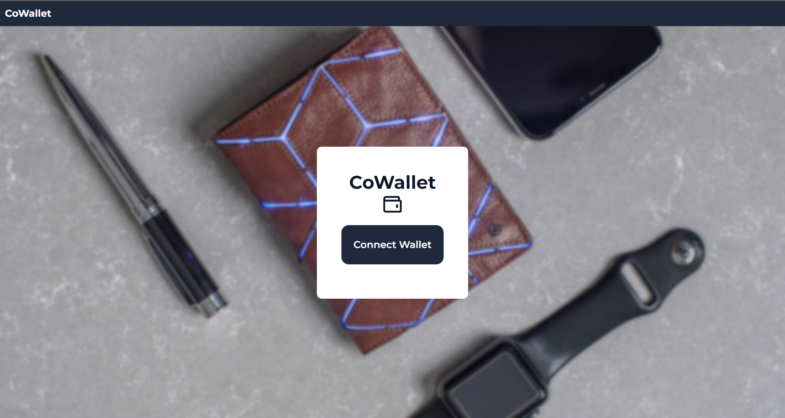

1. Click "Connect" and select from a list of providers to connect to CoWallet.

2. Once connected, you will be able to create or load a CoWallet.

## Creating a CoWallet

To create a CoWallet, follow these steps:

1. Click on "Create CoWallet" and fill in the neccessary details for your smart contract wallet. The default version should be `1` and the max number of CoWallet owners is currently set to `10`.

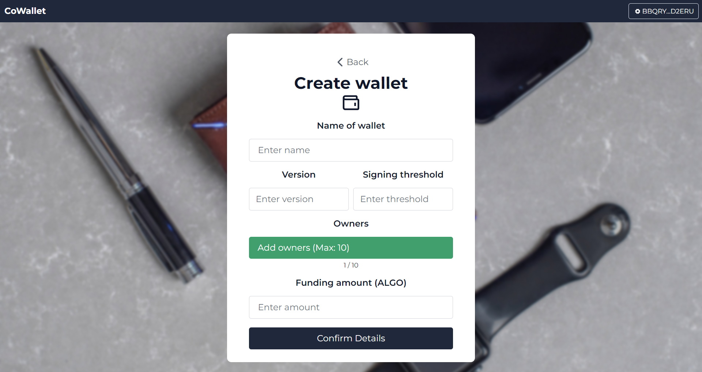

2. Once you click on `Confirm Details` go ahead and confirm the details and proceed to create your CoWallet. You will be prompted to sign two transactions, one for initialising the smart contract, and another for funding your CoWallet.

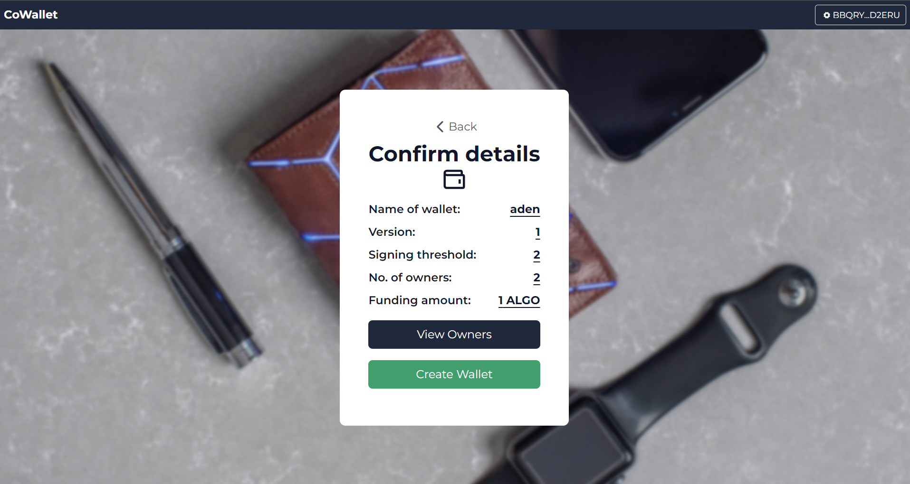

3. Once you have successfully signed both transactions, you will be redirected to your CoWallet dashboard, where you can access multiple other features.

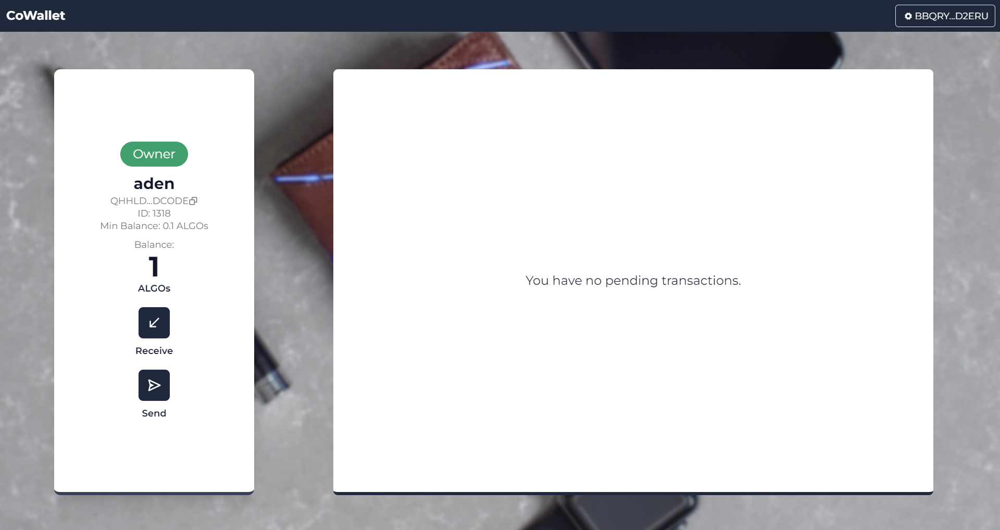

## Creating Transactions

### Receiving Algos

To receive Algos or ASAs from your smart contract wallet, follow these steps:

1. Click `Receive` on your CoWallet dashboard. You will see a pop-up with your CoWallet QR code as well as its public address. Use this address when receiving Algos or ASAs from others.

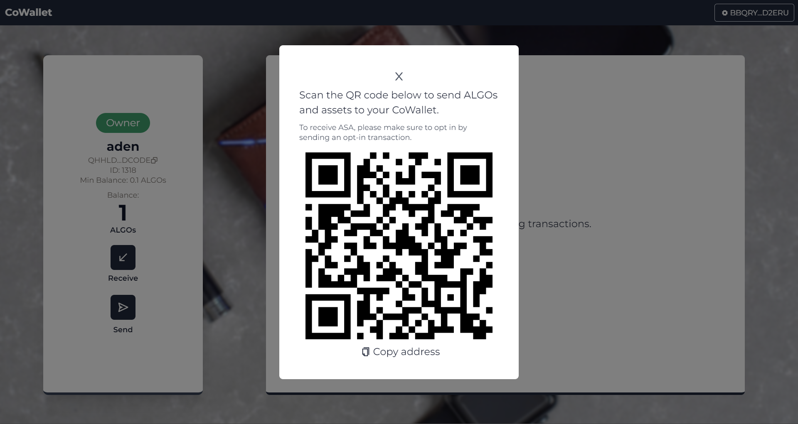

### Sending Algos

To send Algos from your smart contract wallet, follow these steps:

1. Click `Send` on your CoWallet dashboard. You will see a pop-up allowing you to choose your desired transaction type.

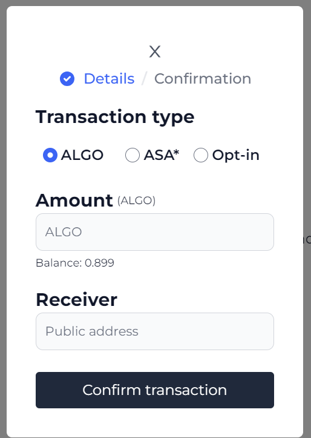

1. Once you have chose your transaction type, fill in the necessary details and click on `Create Transaction`. You will be prompted to confirm the details.

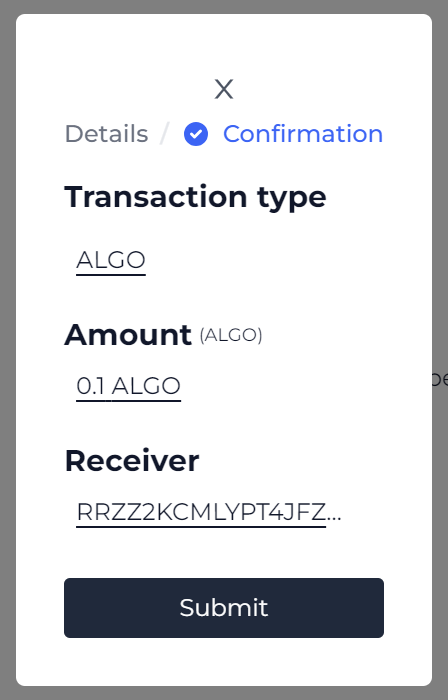

2. Click on `Submit` to create your pending transaction. Once submitted, you should see it appear on your dashboard. Click on the dropdown button to view the details of the pending transactions.

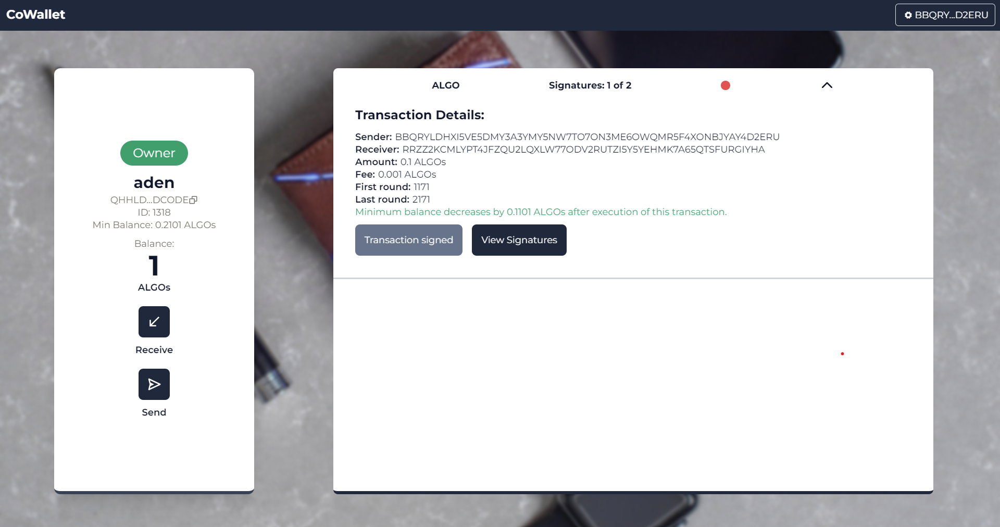

## Signing Transactions

To sign transactions from your CoWallet, follow these steps:

1. Click on `Sign Transaction` in the dropdown view of the pending transaction. You will be prompted to sign the transaction with your connected account. If you are not opted-in to the CoWallet, an opt-in transaction will automatically be added to the atomic transaction you are signing.

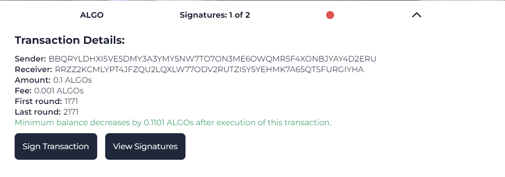

2. Once signed, you should be able to see a success notification as well as the updated status of your pending transaction.

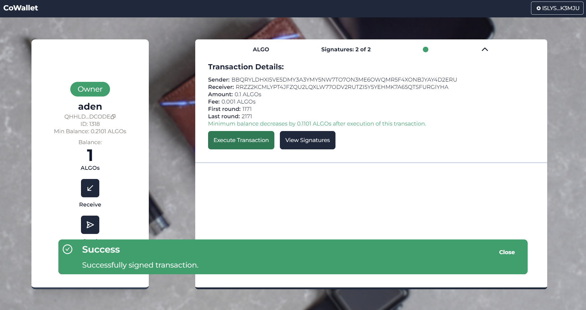

## Executing Transactions

To execute transactions from your CoWallet, follow these steps:

1. One the signing threshold of the pending transaction has been met, you will be able to execute the transaction, provided that you are an owner of the CoWallet.

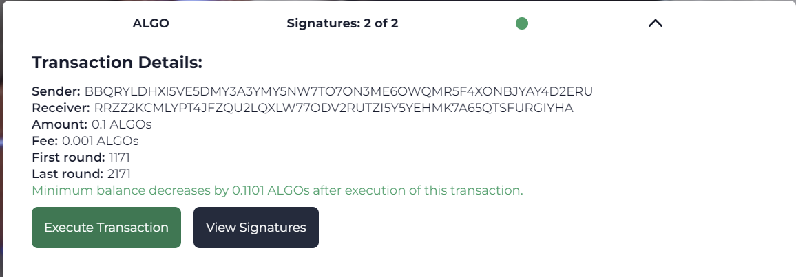

2. Click on `Execute Transaction` to submit the pending transaction to the network. You will be prompted to sign the submit transaction.

## Conclusion

By following the instructions in this user guide, you can create a smart contract wallet, perform various transactions including sending Algos and ASAs, opt into ASAs, receive Algos and ASAs, sign transactions, and execute transactions. Remember to understand the implications and costs associated with each transaction type before proceeding.
